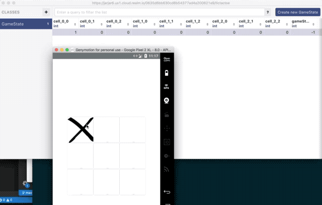

 The following example is a TicTacToe game that you can play against an AI. It demonstrates how you can use the event handler to react to the player's moves. The client side is implemented using React Native.

- Instructions to [run the server](server/README.md)
- Instructions to [run the client](client/tictactoe/README.md)

